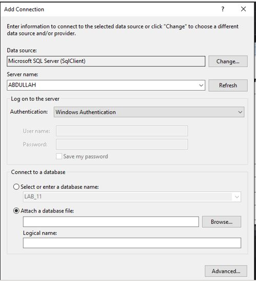
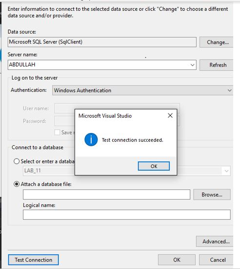
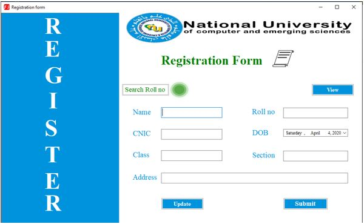
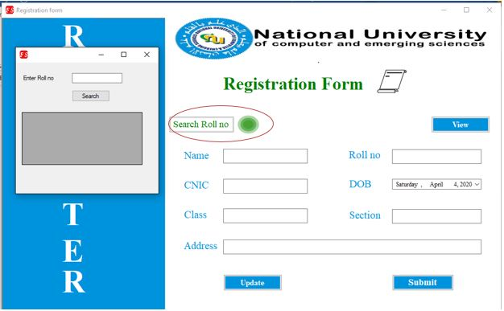
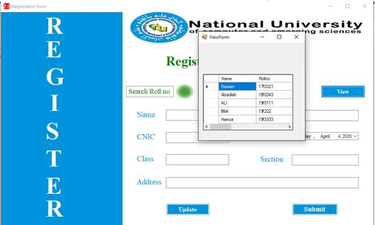
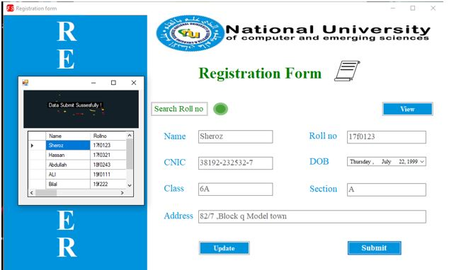
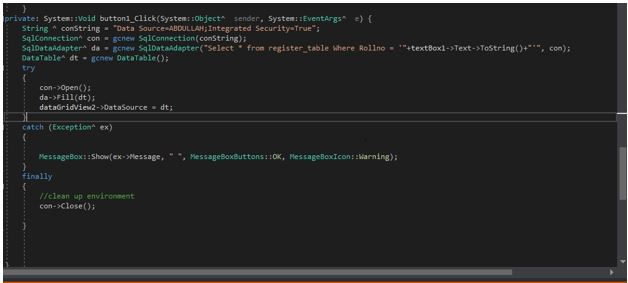

# Registration-Form-In-Visual-Studio
Create registration in visual studio using C/C++ and Sql.

First of we ****connect**** our Application to the Sql server for saving the Record of Students. For this you can create your **Database** in Sql server or by using Visual studio.

In below pic you see that our Application is connect to Sql server.( *You confirm that our Application is connected to the **Sql server or not** by test connection* )

##### Here are some of the Outputs:

#### Insert Function

#### Update Function

#### Search Function

 

 
